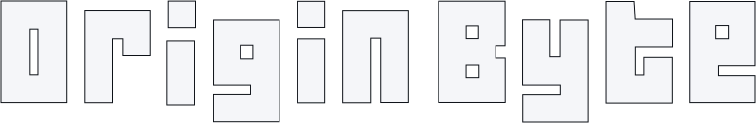

<a href="https://originbyte.io/">
    <h1></h1>
</a>

# LiquidityLayer

The NFT Liquidity Layer is a protocol and ecosystem designed to share liquidity and power market-based features for institutional and retail users alike. Contract implements a central limit orderbook and auction markets to aggregate NFT trading into a single point, across the entire chain.

Origin-Byte is an ecosystem of tools, standards, and smart contracts designed to make life easier for Web3 Game Developers and NFT creators.
From simple artwork to complex gaming assets, we want to help you reach the public, and provide on-chain market infrastructure.

## Resources

- Contracts:
  - [Permissions](https://explorer.sui.io/object/0x16c5f17f2d55584a6e6daa442ccf83b4530d10546a8e7dedda9ba324e012fc40)
  - [Request](https://explorer.sui.io/object/0xe2c7a6843cb13d9549a9d2dc1c266b572ead0b4b9f090e7c3c46de2714102b43)
  - [Liquidity Layer](https://explorer.sui.io/object/0x4e0629fa51a62b0c1d7c7b9fc89237ec5b6f630d7798ad3f06d820afb93a995a)
- [Official Documentation](https://docs.originbyte.io/origin-byte/)
- [Developer Documentation](https://origin-byte.github.io/)
